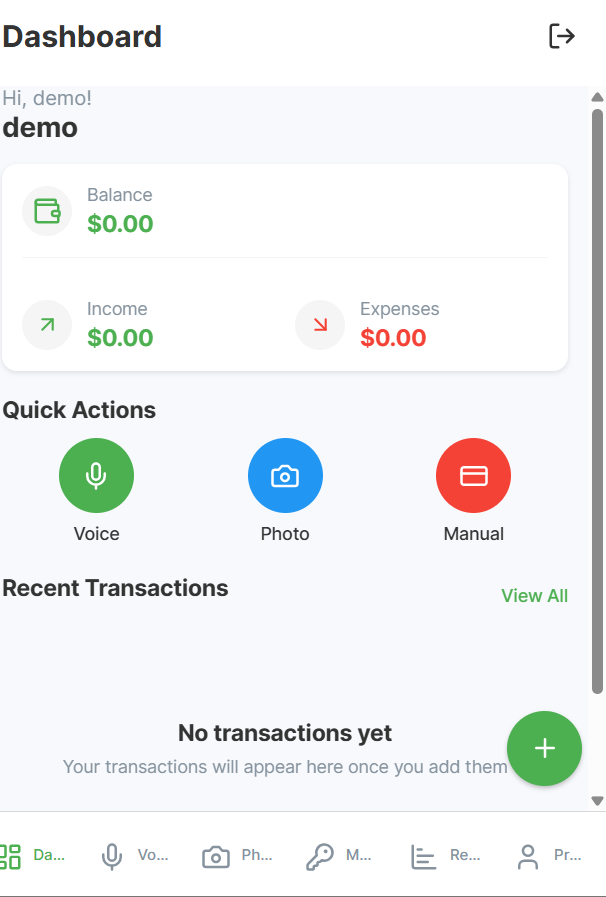
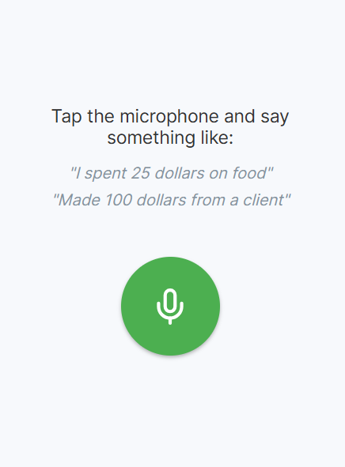
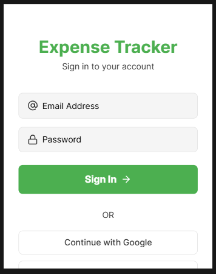
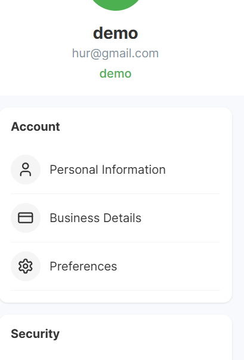

# Expense Tracker PWA for Small Traders

A **Vibe Coding Hackathon** project organised by under the **Retail & Ecommerce** category.  
Built to empower small traders with a lightweight, mobile-first solution to track income and expenses using **voice commands** and **photo receipts**.


## Problem Statement

Many small traders **do not track income or expenses**, making it hard to determine profitability or manage their businesses effectively. They need a simple, low-barrier tool that fits their workflow — ideally mobile, fast, and intuitive.

###  Challenge
Build a mobile/web app that uses **voice** or **photo input** to help business owners track income and expenses in real-time.


##  Prompt (Generated with Claude AI)

**Project Title:** _Mobile Expense Tracker PWA_

###  Overview
A **React-based Progressive Web App** for small business owners to:
- Track transactions using **voice input**
- Snap photos of receipts to extract details using **OCR**
- Easily monitor profits/losses with a clear and user-friendly dashboard

### Authentication
- Email/password registration & login
- Google and Facebook OAuth login
- JWT-based sessions, password resets, and secure logout
- User-based data isolation

### Main Screen
- **Dashboard:** View profit/loss indicators (green/red), recent transactions, quick actions
- **Voice Input:** Use Web Speech API to add transactions like _“Made 50 dollars”_
- **Photo Capture:** Take receipt pictures and use **OCR (Tesseract.js)** to extract amount, date, vendor
- **Manual Entry:** Add income/expenses with a keypad and date picker
- **Reports:** View daily, weekly, and monthly summaries with basic charts and CSV export


##  Stack

| Layer        | Technology                        |
|--------------|------------------------------------|
| **Frontend** | React (PWA, mobile-first, offline-capable) |
| **Backend**  | Node.js + Express or Firebase Auth |
| **Database** | MongoDB or PostgreSQL              |
| **Libraries**| Web Speech API, Tesseract.js, Chart.js, JWT, bcrypt |


## Data Models

### `User`
```js
{
  id,
  email,
  name,
  businessName,
  currency
}
```

### `Transaction`
```js
{
  id,
  userId,
  amount,
  type,         
  category,
  date,
  method,
  notes,
  
}
```

###  Voice Entry
1. Tap microphone button
2. Convert speech to text (e.g. "Made 50 dollars")
3. Parse and confirm transaction
4. Save to DB

### Photo Receipt Entry
1. Take receipt photo
2. OCR extracts amount, vendor, date
3. User confirms/corrects data
4. Save with optional image

### Auth Flow
1. Register/Login
2. Token-based access to dashboard
3. Auto-logout after 30 days


### UI/UX Requirements

- **Mobile-first design**
  - Button size ≥ 44px
  - Font size ≥ 16px
- **Color Scheme**
  -  Income: Green `#4CAF50`
  - Expense: Red `#F44336`
- **Performance Goals**
  - Load time < 3s
  - Voice response < 2s
  - OCR extraction < 5s
- 5–6 basic categories for simplicity
- Offline support + sync when online

---

## File Structure

/components
  ├─ Auth/
  ├─ Dashboard.js
  ├─ VoiceInput.js
  ├─ PhotoCapture.js
  ├─ ManualEntry.js
  └─ Reports.js

/services
  ├─ authService.js
  ├─ speechService.js
  ├─ ocrService.js
  └─ apiService.js

Build functional MVP focusing on core expense tracking with authentication.


##  Development Journey

After exploring various AI coding assistants, including Claude AI for ideation and prompt generation, I eventually settled on **[bolt.new](https://bolt.new)** for prototyping and building the final version. It took **two days of iteration**, debugging, and refinement to achieve the desired functionality and output.


##  Getting Started

###  Prerequisites
- Node.js & npm
- MongoDB or PostgreSQL
- Expo

###  Installation
```bash
git clone https://github.com/Christabel-Akpene/Vibe_Coding_Hackathon.git
cd expense-tracker-pwa
npm install
npm install expo
npm start
```

###  Build & Deploy
```bash
npm run build
```


## Screenshots







